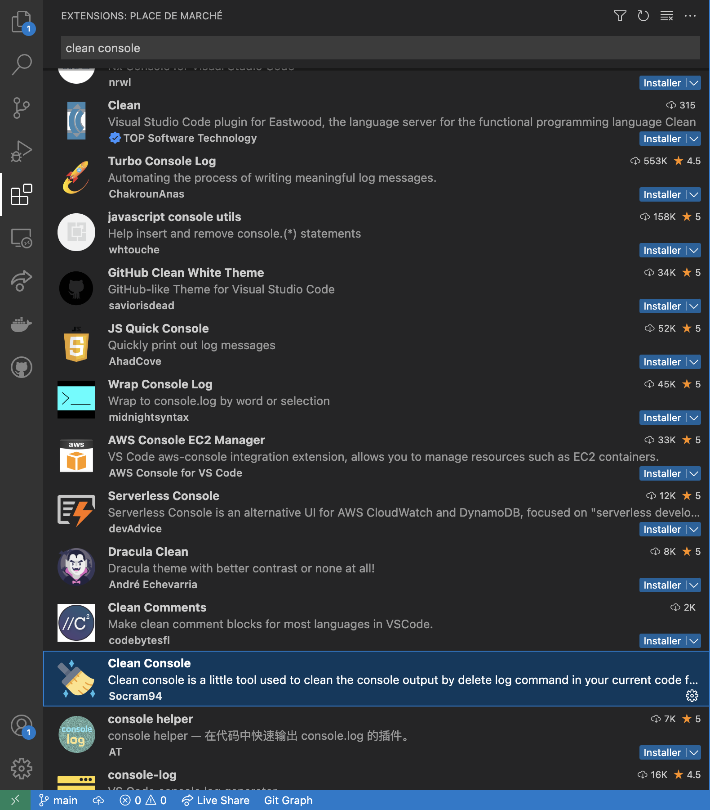

## Features

This extension is used to delete all log line in a single file. You can launch this extension on all files you want to clean.

There is an example bellow with a TypeScript file and a C file (The popup has been deleted for better experience) :


## Requirements

No specific requierement for this extension

## Known Issues

Regex can have some problems, you can add an issue or submit a pull request to correct it.

## Release Notes

### 1.1.1

New feature, you can now count the number of log line in your current file !
You can easily test it with running clean console list command.

The code have been refactored :

- lib.js contain all functions to run the extension
- extension contain the main function of the programm
- config.js contain actual handle languages

### 1.0.1

Bug fix

### 1.0.0

This is the first release of the extension, you can use it only feature without moderation


## Install

You can download the extension on the markeplace :



If you want to modify or just run the extension locally, you first need to :

get the project

```
git clone https://github.com/Socram94/cleanConsole.git
```

go in clean console folder :

```
cd cleanConsole/
```

install package : 

```
npm i
```

You can now modify the extension as you wish, you can press (F5) to run the debugger editor 

## Information

If your favorite language isn't currently supported, you can submit a pull request to add it to the list !

